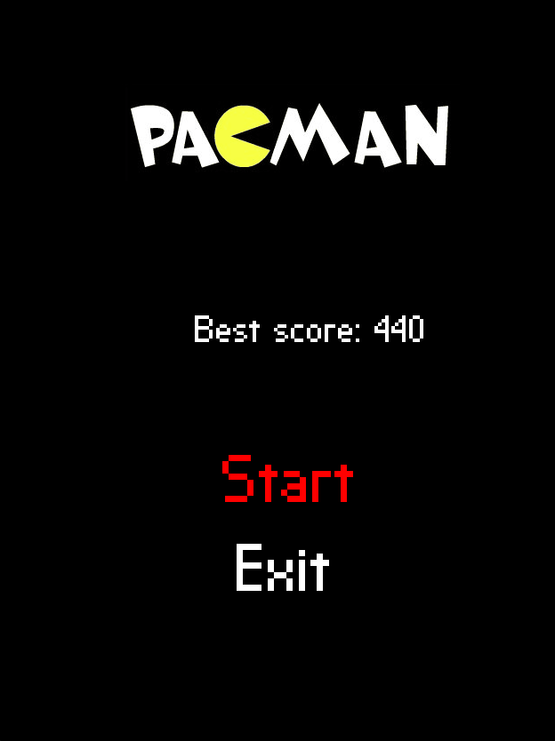

# Pac-Man clone written in C++ using SFML library.

## Build
To build project you need
- CMake >=3.20
- Compiler C++ >=11

SFML is downloaded through CMake FetchContent - no need to download it manually.

```
cmake -B ./build
cmake --build ./build
```




